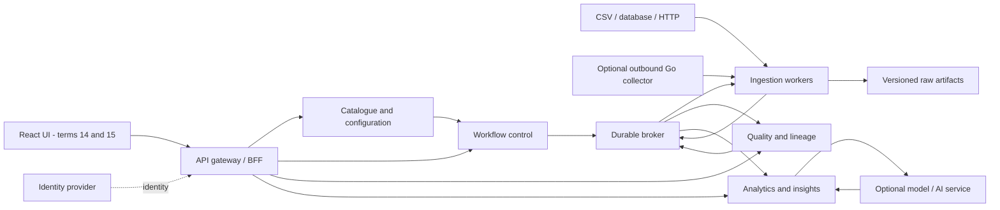

# Microservices architecture

This is the target design. Only the day-one Python seed is implemented in this repository. Introduce deployable services in the roadmap's order and record decisions when a boundary changes.

## System view

Each service also has a private metadata store. These are omitted from the diagram for readability. The broker carries small events and artifact references, not entire datasets. The diagram expresses dependencies; it does not permit every consumer to process every event.

## Boundaries and ownership

| Service | Owns | Exposes | Added |
|---|---|---|---|
| Ingestion | Connector attempts, checkpoints, source record identities and raw artifact manifests | Restricted ingestion API and input-landed event | Python component T1; service T3 |
| Catalogue | Tenant-scoped source definitions, connector configurations and dataset contracts | Source and contract API | T3 |
| Quality and lineage | Rule versions, validation outcomes, quarantine metadata and provenance edges | Quality results, lineage API, validated-artifact event | Component T4; durable service by T6 |
| Workflow | DAG definitions, schedules, runs, attempts, leases and cancellation | Run command/status API and execution requests | T5–T6 |
| Analytics and insights | Metric definitions, derived output manifests and deterministic insights | Insight/report API and computed-output event | T8 |
| Model and AI | Model versions, evaluation records and authorized inference requests | Forecast/explanation API | T11–T12, optional launch feature |
| Gateway / BFF | Browser-facing routing and response composition; no domain database | Stable UI API | Harden service access early; UI composition T14 |
| Identity provider | Users, authentication sessions and identity lifecycle | Standard identity integration | Before multi-user use in T6 |

Business services validate authorization themselves even behind a gateway. Use separate database credentials and private databases or schemas with enforced access boundaries. One local PostgreSQL instance can host several isolated stores for learning. Do not allow cross-service SQL joins or shared ORM entities. Populate analytical read models through documented events or APIs. This follows the principle of [service-owned domain data](https://learn.microsoft.com/en-us/dotnet/architecture/microservices/architect-microservice-container-applications/data-sovereignty-per-microservice).

For multi-tenant storage, tenant scope is mandatory in keys, access checks and queries. Add defence in depth such as row-level policies where appropriate, while still testing application authorization. Object paths and caches must also preserve tenant isolation.

## Technology decisions

Python and FastAPI form the primary service implementation path. PostgreSQL stores durable metadata; immutable files/object storage hold raw and derived artifacts. Introduce one durable broker when persistent jobs are understood. Evaluate a small broker such as RabbitMQ against explicit acknowledgement, persistence, redelivery and operating requirements before pinning its supported version. Kafka and multiple orchestration systems are not initial requirements.

Use containers for reproducibility. Learn Kubernetes and Terraform through bounded labs and adopt only the production topology that can be operated within the pilot budget. A small container deployment may satisfy an initial pilot if its security, backup, monitoring and recovery evidence meets the same gates. Microservices do not require Kubernetes.

Keep C/C++ labs separate from the deployed runtime until correctness and measured performance justify integration. Rust may replace a parser component. Go may implement the collector. Java may implement a read-only adapter. Do not create a service merely to use a language.

## Contracts

Version public APIs, publish their schemas, validate request and response bodies and use stable error categories. A run-creation response points to a durable status resource rather than pretending that queued work is complete. Separate a logical run from each execution attempt.

An event envelope includes `event_id`, `event_type`, `schema_version`, `occurred_at`, `producer`, `tenant_id`, `correlation_id`, `causation_id`, `run_id` and a small payload. Dataset events carry an artifact reference, checksum, row counts, contract version and source snapshot/checkpoint identity. An event's tenant field is validated against the authenticated producer's scope.

The receiver enforces supported versions and rejects invalid events to a reviewable failure path. Backward-compatible fields are additive where possible; breaking changes require versioned contracts and migration tests. Event consumers subscribe only to relevant event types. Do not rely on global ordering. If an operation needs per-source ordering, define its key, sequence and gap policy.

## Delivery and consistency

Assume at-least-once message delivery. Use an outbox when a service must update its state and publish an event. Commit both in one local database transaction, then let a retryable relay publish the event. Use an inbox/deduplication record and the corresponding side effect in the consumer's local transaction. This addresses dual-write failures but still requires replay, retention and artifact handling rules. [AWS transactional outbox guidance](https://docs.aws.amazon.com/en_en/prescriptive-guidance/latest/cloud-design-patterns/transactional-outbox.html).

Source-record identity, event identity and client-request idempotency are different keys. Define all three. Repeated identical requests may reuse a response; reusing a key with a different payload must fail explicitly. Set a documented key retention period and explain behaviour beyond it.

For large artifacts, write to a temporary object, verify checksum, then publish its manifest after finalization. Handle orphaned temporary objects through expiry and reconciliation. A successful database transaction does not automatically make an object-store write atomic.

Retries use bounded attempts, jitter and error classification. Invalid records go to quarantine; invalid tasks go to a reviewable failed/dead-letter state. Use leases and heartbeats to recover abandoned work. Bound concurrency, memory, file sizes and queues. Define cancellation races and ownership before implementing them.

Recovery drills must cover crashes before commit, after commit but before publish, after publish but before acknowledgement, mid-upload, during checkpoint advancement and during a rolling upgrade. Demonstrate no missing accepted records and no duplicated business effects under the tested conditions; do not advertise universal exactly-once delivery.

## Customer connectors

A connector declares its identifier/version, configuration schema, supported operations, credential requirements, pagination/checkpoint semantics and output contract. Its conformance tests cover connection failure, malformed input, schema drift, duplicates, retry and resumption.

Use read-only source permissions initially. Secrets live in a managed secret store or protected local development mechanism, referenced by identifier instead of embedded in configuration. Restrict destinations and egress to resist server-side request forgery. Test redirects, internal addresses and DNS changes according to the deployment's permitted-network policy.

Installable collectors use scoped short-lived credentials where feasible, outbound connections, bounded local spool, documented upgrades, revocation and uninstall. Review executable connectors before deployment. Arbitrary customer-supplied code requires a separate sandbox design and is outside first launch scope.

## Observability and data reliability

Correlate logs, metrics and traces through request/run identifiers. Measure job latency, queue lag, failures, retry exhaustion, quality-rule outcomes, freshness and completeness. Avoid record contents or secrets in telemetry and avoid unbounded identifier labels in metrics. [OpenTelemetry signals](https://opentelemetry.io/docs/concepts/signals/).

Record dataset/job/run provenance and output versions. The learning design draws on [OpenLineage](https://openlineage.io/docs/) and [Dagster assets](https://docs.dagster.io/guides/build/assets), without requiring an entire orchestration framework from day one.

Data correctness and source freshness need their own objectives alongside API availability. A healthy endpoint can still return stale data. [SLO implementation guidance](https://sre.google/workbook/implementing-slos/).

## Production implementation standard

Every deployed service has: a named owner; configuration schema; locked dependencies; input/resource limits; authenticated interfaces; authorization tests; controlled database migrations; readiness/liveness semantics; graceful shutdown; structured telemetry; meaningful tests; a reproducible immutable image; backup/restore scope; and a runbook. CI tests the exact artifact intended for deployment. Prefer immutable action references and least workflow permissions following [GitHub's secure-use guidance](https://docs.github.com/en/actions/reference/security/secure-use?learn=getting_started).

Use [OWASP ASVS](https://owasp.org/www-project-application-security-verification-standard/) to select and verify applicable application security requirements. Record applicability and evidence instead of treating a scanner result as complete security assurance. Exact deployment provider, budget, domain, pilot load and operational owner are decisions to settle before customer launch.
